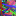

# seqToCanvas
Tool to convert text or hexadecimal sequence into canvas image as generative art.  
GitHub: https://github.com/YujiSODE/seqToCanvas  
Wiki: https://github.com/YujiSODE/seqToCanvas/wiki  
>Copyright (c) 2021 Yuji SODE \<yuji.sode@gmail.com\>  
>This software is released under the MIT License.  
>See LICENSE or http://opensource.org/licenses/mit-license.php  
______

## 1. Description
`seqToCanvas` is tool to convert text or hexadecimal sequence into canvas image.  
This tool describes another aspect of text.

### [Algorithm](algorithm.md)
Main algorithm is composed of 16 internal methods to draw on a canvas element.  
These methods take the form of function: `f(e1, e2, e3, e4)` where `f, e1, e2, e3` and `e4` are single hexadecimal digits.

## 2. Script
- [`seqToCanvas.js`](seqToCanvas.js)
- [v2.0 beta+][`seqToCanvas_arc.js`](seqToCanvas_arc.js)
- [v3.0 beta+][`seqToCanvas_dot.js`](seqToCanvas_dot.js)

### Additional HTML interface
- `index.html`
- `index_style.css`
- `capturingCanvas_min.js`
- `index_main.js`

## 3. Library list
- Sode, Y. 2018 capturingCanvas/capturingCanvas.js: the MIT License; https://gist.github.com/YujiSODE/26819973169511a5ab3e0f64612d557b
